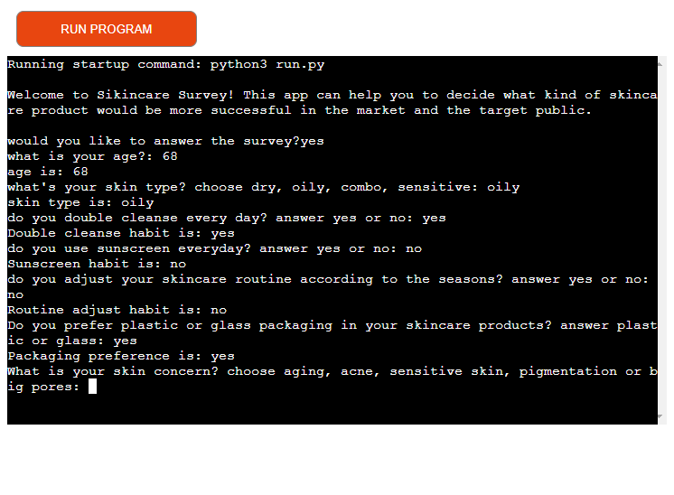
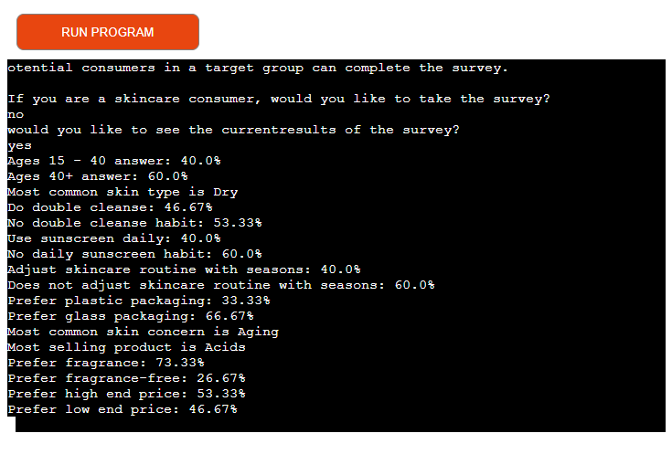

# Skincare Survey

[View the live project here](https://lukyhet.github.io/Project_three/)

## Introduction

Our app offers the possibility to apply a survey that gathers important information for market researchers or companies interested in launching new skincare products. The app works by collecting possible customers preferences data through a 10 questions survey. The survey asks about the potential customer skincare habits, age and skin type to compile it and give results that can show what is the most common skin type, the most favourite skincare product or the customers packaging preferences. 

The results have the potential to be used in market studies for companies intested in the data as it gives access to the skincare markets information directly taken from skincare consumers. The target audience is companies, entrepreneurs, students and researchers that are interested in the data about skincare consumers preferences.

## Details

Skincare Survey app is a tool created for comercial research purposes. It is an automated survey that has ten different questions about the skincare habits and preferences of a skincare consumer group.

This app was made as the third milestone project to achieve the Diploma in Software Development at the Code Institute. 

The purpose of this back-end project is the automation of a survey that gathers information and gives results obtained from the 10 answers to the same number of questions about skincare preferences and habits. The main goal was to build a back end site using python as a main language, and make it so it would respond to the users actions, allowing the user to access the data and use it for their comercial or research goals.

## UX

###  User Demographic

The user for this website is: 

- Companies, entrepreneurs, students and researchers that want to collect skincare consumers market data to create and sell new skincare products to young and adult skincare consumers, or just for research purposes. The skincare consumers are people who has a skincare concern and who are interested in purchasing new skincare products to tackle their skin problems. 

#### User Goals

- To apply a survey/research tool aimed to gather information from potential consumers/users to help define what skincare product would be best to create and sell according to the preferences of the potential consumers. 

- Gather information for research pouposes. 

- Have an efficient and automated instrument (survey) to apply that also automates the process of updating the database.

- Have clear results and data to work with.

## Features 

This is a back-end application made using python deployed to Heroku. 

The app greets the user and asks "do you want to take the survey?" if the answer is yes, it applies a survey that poses 10 different questions about skincare habits and preferences, some of them offer multiple answer options and others are simple yes or no questions. The client/user can use the app both for collecting the data, and producing the results. The app can both read the information from the base (google sheets skincare_survey document) and write on it, updating it from the app.

The functions in the app contain loops that validate the answers of the user and accept only the correct kind of input, and insist in the question until the user enters the valid response.

As the survey app asks some questions that offer several options of answers, in the case of a tie the app can report it in the results, showing for example the two or three most prefered skincare products.

#### Wireframes
  

This project is a back-end app and it does not involve aesthetic design, the blueprints of the project or initial work was done by creating the questions and answer options that would collect the specific data to offer valuable results for clients interested in launching a successful new skincare product or for skincare consumers market researchers.

## Debugging

Some of the problems detected by gitpod have to do with non fatal errors like long lines of code that are related to the lenght of the questions and answer options.

A bug related to printing a result in case of a tie instead of a blanck space was detected and fixed by including lines of code that would print if the options are equal in value (==) and stil mayor than other options (>=).

`if (acids_list_len == serum_list_len) and (acids_list_len == moisturizer_list_len):
        print('All products sold equally')
    else:
        print('Most selling product is %s' % most_common)`

Other kind of bugs that were detected had to do with validation of input in the functions. It was necessary adjust and correct.

Other bug was related to the deployment of the app in Heroku, there was an incompatibility between versions of the packagest installed at the requirements.txt file. The solution was to run the command:

`pip3 freeze > requirements.txt`

### Features to Implement in the future

**Recommendations**

We would like to include an option in the app that would add a third step after processing the data  and then come up with recommended options for potentially successful skincare products, but we are conscious that the process to come to those sugestions requires to collect more data and perhaps other market reading strategies.
     

## Main Languages Used

- [HTML5](https://en.wikipedia.org/wiki/HTML5 "Link to HTML Wikipedia") provided by the CI template for this project.
- [JS](https://en.wikipedia.org/wiki/JavaScript "Link to JS Wikipedia") provided by the CI template for this project.
- [PY](https://en.wikipedia.org/wiki/Python_(programming_language) "Link to PY Wikipedia")main code source for this back-end project.

### Frameworks, Libraries & Programs Used

- [GitPod](https://gitpod.io/ "Link to GitPod homepage")
     - GitPod was as workspace for writing code,
- [GitHub](https://github.com/ "Link to GitHub")
     - GitHub is being used to store this repository.
- [Heroku](https://heroku.com/ "Link to Heroku")
     - Heroku is being used to deploy and host the app.
- [Google Sheets](https://docs.google.com/ "Link to Google Sheets")
     - Google Sheets is being used to host and consolidate the information of the survey.
- [Google Cloud](https://console.cloud.google.com/home/dashboard?project=skincaresurvey "Link to Google  Cloud Platform")
     - In google Cloud we have enabled the Google Sheets API (which writes and reads in Google Sheets) and Google Drive API (which access our data stored in google drive).
-[google-auth](https://google-auth.readthedocs.io/en/master/ "Link to documentation about the libary") 
     -Dependancy used in this project as google authentication library for python.
-[gspread](https://docs.gspread.org/en/latest/ "Link to documentation of the libary") 
     - Used in this project as pythons API for google sheets.

## Testing

The "PEP8" Validator  website was used to validate all the code of this repository and the errors detected were corrected.

-PEP8 Validator [PEP8](http://pep8online.com/checkresult/ "Link to PEP8 validator")

Some of our validation results:

## Deployment

This project was deployed in Github [View the live project here](https://lukyhet.github.io/Repository-Two/).

### Deploying on GitHub Pages

The following steps were taken to deploy this site from the GitHub repository:

-  Once in our github account, click in the [GitHub Repository](https://lukyhet.github.io/Project_three/ "Link to repository").

-  In the repository, select Settings from the menu items.

-  Scroll down the Settings page to the "Pages" section.

-  In "Source" click the drop-down menu that says "None" and select "Main".

-  The page will automatically refresh meaning that the website is now deployed.

-  Scroll down to the "Pages" section one more time to see the deployed link.

     

### Deploying on Heroku

The Skincare Survey app was deployed in Heroku - [View the heroku app here](https://skincare-survey.herokuapp.com/ "Link to Heroku app") The following steps were taken to the deployment.

**In the terminal** 

-  Add the requirements by writing this command in the terminal: "pip3 freeze --local > requirements.txt".

-  Git add . and git commit your changes.

**Go to your heroku account**

-  Log into [Heroku](https://dashboard.heroku.com/apps). If you don't have an account create one.

-  In the top right corner click "new" and select "Create new app".

-  Create a name for your app. It must be unique.

-  Choose Region - Ex: "Europe".

-  Click "Create App".

**In your project page**

-  In the Resources Tab, Add-ons, look for "Heroku Postgres" and select it.

-  Go to menu in the top of the page and choose "settings".

-  Go to "Config Vars" and click "Reveal Config Vars". 

-  Add the below variables to the list:

-  Database URL will be added automaticaly.

-  In the field for Key we write CREDS, then paste the content of our creds.json file as value, ten click add. 

-  Go to the right side of the page and Add the buildpack "Python". Save the changes.

-  Go to add buildpack again in the right side of the page and add node.js. Save the changes. Check that python is on top and node.js underneath, if not, drag and change the order.

-  Go to the menu and click in the deployment method, select gitHub. Click "connect to GitHub".

-  Enter your GitHub repository name and click search and then click "connect".

-  Choose to manually or automatically deploy, then you should see "The app was successfully deployed" message.

-  Click in "view" to take a look at your app. If you need to restart click "Run Program".

    
## Credits 

### Code 

Several sources were consulted and their guides followed, for example:

- [Stack Overflow](https://stackoverflow.com/ "Link to Stack Overflow page")
- [Stack Overflow](https://stackoverflow.com/questions/53162/how-can-i-do-a-line-break-line-continuation-in-python/ "Link to Stack Overflow ansers about fixing long lines errors in Python")
- [W3Schools](https://www.w3schools.com/ "Link to W3Schools page") 

### Media

- Google sheets [Google Sheets](https://docs.google.com/spreadsheets/u/0/ "Link to Google Sheets") 
- Heroku [Heroku](https://id.heroku.com/login "Link to Heroku")
- Google Cloud Platform [Google Cloud](https://console.cloud.google.com/home/dashboard?project=skincaresurvey "Link to Google Cloud Platform")
- Google Drive [Google Drive](https://www.google.com/intl/es/drive/ "Link to Google Drive")

## Acknowledgements

- I want to thank and recognize once again the amazing job of my mentor Antonio Rodriguez who has guided me in a clear way during this project. 

- I also want to mention and thank the student tutors service at Code Institute.

[Back to top](#Skincare Survey)

***

-----